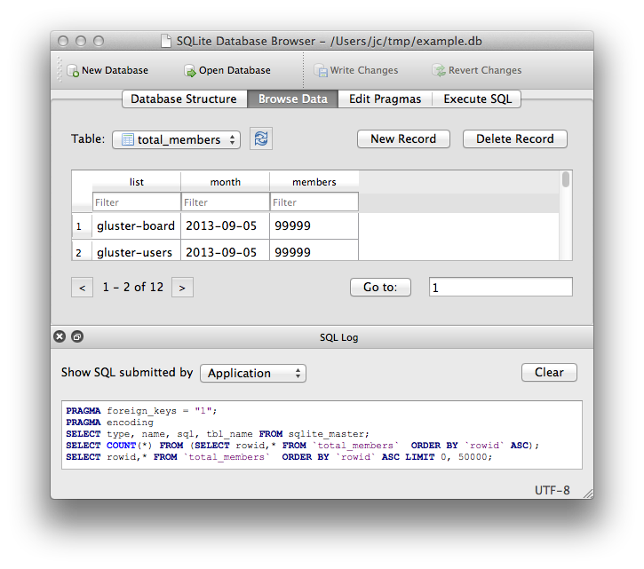

# CS448 PSO1 SQLITE3 demonstration

SQLite is a C-language library that implements a small, fast, self-contained, SQL database engine, which is sufficient building a personal database for daily usage. In this PSO1, we will demonstrate how to install and manage a sqlite database. In addition, we will cover the basic usage of SQL language which is a standard language for managing relational databases such as MYSQL, PostgresSQL, ORACLE, SQLite, and etc.

The document is created based on [tutorialspoint](https://www.tutorialspoint.com/sqlite/index.htm)
## 1. SQLite Installation

- Window
  - Step 1 − Go to SQLite [download page](https://www.sqlite.org/download.html), and download pre-compiled binaries from Windows section.

  - Step 2 − Download `sqlite-shell-win32-\*.zip` and `sqlite-dll-win32-\*.zip` zipped files.

  - Step 3 − Create a folder `C:\>sqlite` and unzip above two zipped files in this folder, which will give you `sqlite3.def`, `sqlite3.dll` and `sqlite3.exe` files.

  - Step 4 − Add `C:\>sqlite` in your PATH environment variable and finally go to the command prompt and issue sqlite3 command, which should display the following result.

- Linux and Mac are pre-installed.

- You can visit (https://www.tutorialspoint.com/sqlite/sqlite_installation.htm) for installation details.

- GUI: DB Browser for SQLite is a cross-platform SQLite GUI which allows you to manage a SQLite database much easier. You are able to perform all database management operation through graphics user interface. Check it out on https://sqlitebrowser.org/



## 2. Database Management
- Create Database in SQLite
```bash
sqlite3 [dbname]
# sqlite3 /tmp/testDB.db
```
- List Database in `sqlite` prompt
```
sqlite> .databases
main: /tmp/testDB.db
```

- Open or Re-Open an existing database
```bash
sqlite> .open [dbname]
# [.open /tmp/testDB.db]
```

- Quit SQLite
```bash
sqlite> .quit
```

- Notice

In SQLite command interface, we use dot(`.`) prefixed command such as `.table`, `.open`, `.quit`, and etc to manage the database. These commands are only available in SQLite, and are not part of the SQL standard. In other database like MYSQL, you can find similar commands.
## 3. Tables Management

- Syntax

Following is the basic syntax of `CREATE TABLE` statement.
```sql
CREATE TABLE database_name.table_name (
   column1 datatype PRIMARY KEY(one or more columns),
   column2 datatype,
   column3 datatype,
   .....
   columnN datatype
);
```

datatype can be text, numeric, integer, real, and none. For details, please read this article https://www.tutorialspoint.com/sqlite/sqlite_data_types.htm.

- Table creation

Following is an example which creates a `classroom` table with `building` and `room_number` as the primary key.

| building  | room_number | capacity |
| --------- | ----------- | -------- |
| Lamberton | 134         | 10       |
| Chandler  | 375         | 10       |
| Fairchild | 145         | 27       |
| Nassau    | 45          | 92       |
| Grace     | 40          | 34       |

```sql
create table classroom (
    building        varchar(15),
    room_number     varchar(7),
    capacity        numeric(4,0),
    primary key (building, room_number)
);
```

- List Tables

You can verify if your table has been created successfully using SQLite command `.tables` command, which will be used to list down all the tables in an attached database.
```
sqlite> .tables
classroom
```

- Table Info

You can get complete information about a table using the following SQLite `.schema` command.
```
sqlite> .schema classroom
CREATE TABLE classroom (
    building        varchar(15),
    room_number     varchar(7),
    capacity        numeric(4,0),
    primary key (building, room_number)
);

```

- Drop Table

Let us first verify `classroom` table and then we will delete it from the database.
```
sqlite> .tables
classroom
```

This means `classroom` table is available in the database, so let us drop it as follows −
```
sqlite> DROP TABLE classroom;
```

Now, if you try `.tables` command, then you will not find `classroom` table anymore.
```
sqlite> .tables
```

## 4. Import and Dump database

- Import a database from a `.sql` file
```
sqlite> .read [SQL File]
```

- Dump a database into a `.sql` file
```
sqlite> .output [SQL file]
sqlite> .dump
```

You need to specific the output file first, otherwise the `.dump` command will output the sql in the shell

## 5. Database Operations

To manage the data records in a database, we can perform four types of operations: `SELECT`, `INSERT`, `UPDATE`, and `DELETE`, whereas `SELECT` is read operation, and `INSERT`, `UPDATE`, and `DELETE` are write operations, which are summarized in the following
  - Read
    - Select
  - Write
    - Insert, Update, Delete

### Import data

The database schema we used here comes from the textbook website. You could find them on https://www.db-book.com/db7/university-lab-dir/sample_tables-dir/index.html
```
sqlite> .read DDL.sql
sqlite> .read smallRelationsInsertFile.sql
```

### INSERT Query

- Syntax
```
INSERT INTO TABLE_NAME [(column1, column2, column3,...columnN)]  
VALUES (value1, value2, value3,...valueN);
```

- Recall the definition of `classroom` table
```
sqlite> .schema classroom
CREATE TABLE classroom (
    building        varchar(15),
    room_number     varchar(7),
    capacity        numeric(4,0),
    primary key (building, room_number)
);
```

- Insert a row into `classroom` table
```
insert into classroom values ('Lawson', '10', '500');
```

### SELECT Query
- Syntax
```
SELECT column1, column2, columnN FROM table_name;
```
Here, column1, column2 ... are the fields of a table, whose values you want to fetch. If you want to fetch all the fields available in the field, then you can use the following syntax
```
SELECT * FROM table_name;
```

- Example

Lookup the data in `classroom` table
```
# Setup a properly output format
sqlite> .header on
sqlite> .mode column
# Lookup the data
sqlite> SELECT * FROM classroom;
building    room_number  capacity  
----------  -----------  ----------
Packard     101          500       
Painter     514          10        
Taylor      3128         70        
Watson      100          30        
Watson      120          50        
Lawson      10           500     
```

### WHERE Clause
SQLite `WHERE` clause is used to specify a condition while fetching the data from one table or multiple tables.

If the given condition is satisfied, means true, then it returns the specific value from the table. You will have to use `WHERE` clause to filter the records and fetching only necessary records.

The WHERE clause not only is used in `SELECT` statement, but it is also used in `UPDATE`, `DELETE` statement, etc., which will be covered later.

- Syntax
```
SELECT column1, column2, columnN
FROM table_name
WHERE [condition]
```

- Example

Consider `classroom` table with the following records.

```
building    room_number  capacity  
----------  -----------  ----------
Packard     101          500       
Painter     514          10        
Taylor      3128         70        
Watson      100          30        
Watson      120          50        
Lawson      10           500     
```

We will find records which the capacity is smaller than 100.
```
sqlite> SELECT * FROM classroom WHERE capacity < 100;
building    room_number  capacity  
----------  -----------  ----------
Painter     514          10        
Taylor      3128         70        
Watson      100          30        
Watson      120          50   
```

You can use other logical operators such as ` >, <, =, LIKE, NOT`, etc

### AND & OR Clause
SQLite **AND** & **OR** operators are used to compile multiple conditions to narrow down the selected data in an SQLite statement. These two operators are called **conjunctive** operators.

- Syntax
```
SELECT column1, column2, columnN
FROM table_name
WHERE [condition1] [AND or OR] [condition2]...[AND or OR] [conditionN];
```

- Example

Consider `classroom` table with the following records.

```
building    room_number  capacity  
----------  -----------  ----------
Packard     101          500       
Painter     514          10        
Taylor      3128         70        
Watson      100          30        
Watson      120          50        
Lawson      10           500     
```

We will find records which the capacity is smaller than 100 and larger than 20.

```
sqlite> SELECT * FROM classroom WHERE capacity < 100 AND capacity > 20;
building    room_number  capacity  
----------  -----------  ----------
Taylor      3128         70        
Watson      100          30        
Watson      120          50    
```

### UPDATE Query
SQLite `UPDATE` Query is used to modify the existing records in a table. You can use `WHERE` clause with UPDATE query to update selected rows, otherwise all the rows would be updated.

```
UPDATE table_name
SET column1 = value1, column2 = value2...., columnN = valueN
WHERE [condition];
```

- Example

Consider `classroom` table with the following records.

```
building    room_number  capacity  
----------  -----------  ----------
Packard     101          500       
Painter     514          10        
Taylor      3128         70        
Watson      100          30        
Watson      120          50        
Lawson      10           500     
```

Following is an example, which will update `classroom` which building is Watson and room_number is 100.
```
sqlite> UPDATE classroom SET capacity = 1000 WHERE building = 'Watson' AND room_number = 100;
```

Now classroom table will have following records:
```
building    room_number  capacity  
----------  -----------  ----------
Packard     101          500       
Painter     514          10        
Taylor      3128         70        
Watson      100          1000      
Watson      120          50        
Lawson      10           500    
```

### DELETE Query
SQLite DELETE Query is used to delete the existing records from a table. You can use WHERE clause with DELETE query to delete the selected rows, otherwise all the records would be deleted.

- Syntax
```
DELETE FROM table_name
WHERE [condition];
```

- Example

Consider `classroom` table with the following records.

```
building    room_number  capacity  
----------  -----------  ----------
Packard     101          500       
Painter     514          10        
Taylor      3128         70        
Watson      100          30        
Watson      120          50        
Lawson      10           500     
```

We will delete the classroom which building equals to Lawson.

```
sqlite> DELETE FROM classroom WHERE building = 'Lawson';
```
Now classroom table will have following records:
```
building    room_number  capacity  
----------  -----------  ----------
Packard     101          500       
Painter     514          10        
Taylor      3128         70        
Watson      100          1000      
Watson      120          50     
```

If you want to DELETE all the records from `classroom` table, you do not need to use WHERE clause with DELETE query, which will be as follows

```
sqlite> DELETE FROM classroom;
```

## 6. Advanced SELECT

In SQLite, we can perform more complicated SELECT operations such as JOIN, LIKE, LIMIT, ORDER BY, GROUP BY, HAVING, AGGREGATION, DISTINCT

### JOIN

SQLite Joins clause is used to combine records from two or more tables in a database. A JOIN is a means for combining fields from two tables by using values common to each.

SQL defines three major types of joins
- The CROSS JOIN
- The INNER JOIN
- The OUTER JOIN

Before we proceed, let's consider two tables `classroom` and `department`.


The first table is `classroom` table with the following records.

```
building    room_number  capacity  
----------  -----------  ----------
Packard     101          500       
Painter     514          10        
Taylor      3128         70        
Watson      100          30        
Watson      120          50        
Lawson      10           500     
```

The second table is `department` table with the following records.

```
dept_name   building    budget    
----------  ----------  ----------
Biology     Watson      90000     
Comp. Sci.  Taylor      100000    
Elec. Eng.  Taylor      85000     
Finance     Painter     120000    
History     Painter     50000     
Music       Packard     80000     
Physics     Watson      70000     
```

#### - The CROSS JOIN

CROSS JOIN matches every row of the first table with every row of the second table. If the input tables have x and y row, respectively, the resulting table will have x*y row. Because CROSS JOINs have the potential to generate extremely large tables, care must be taken to only use them when appropriate.

Following is the syntax of CROSS JOIN

```
SELECT ... FROM table1 CROSS JOIN table2 ...
```

Here is the CROSS JOIN result of `classroom` and `department`:
```
sqlite> SELECT * FROM classroom CROSS JOIN department;
building    room_number  capacity    dept_name   building    budget    
----------  -----------  ----------  ----------  ----------  ----------
Packard     101          500         Biology     Watson      90000     
Packard     101          500         Comp. Sci.  Taylor      100000    
Packard     101          500         Elec. Eng.  Taylor      85000     
Packard     101          500         Finance     Painter     120000    
Packard     101          500         History     Painter     50000     
Packard     101          500         Music       Packard     80000     
Packard     101          500         Physics     Watson      70000     
Painter     514          10          Biology     Watson      90000     
Painter     514          10          Comp. Sci.  Taylor      100000    
Painter     514          10          Elec. Eng.  Taylor      85000     
Painter     514          10          Finance     Painter     120000    
Painter     514          10          History     Painter     50000     
Painter     514          10          Music       Packard     80000     
Painter     514          10          Physics     Watson      70000     
Taylor      3128         70          Biology     Watson      90000     
Taylor      3128         70          Comp. Sci.  Taylor      100000    
Taylor      3128         70          Elec. Eng.  Taylor      85000     
Taylor      3128         70          Finance     Painter     120000    
Taylor      3128         70          History     Painter     50000     
Taylor      3128         70          Music       Packard     80000     
Taylor      3128         70          Physics     Watson      70000     
Watson      100          1000        Biology     Watson      90000     
Watson      100          1000        Comp. Sci.  Taylor      100000    
Watson      100          1000        Elec. Eng.  Taylor      85000     
Watson      100          1000        Finance     Painter     120000    
Watson      100          1000        History     Painter     50000     
Watson      100          1000        Music       Packard     80000     
Watson      100          1000        Physics     Watson      70000     
Watson      120          50          Biology     Watson      90000     
Watson      120          50          Comp. Sci.  Taylor      100000    
Watson      120          50          Elec. Eng.  Taylor      85000     
Watson      120          50          Finance     Painter     120000    
Watson      120          50          History     Painter     50000     
Watson      120          50          Music       Packard     80000     
Watson      120          50          Physics     Watson      70000     
```

#### - The INNER JOIN
INNER JOIN creates a new result table by combining column values of two tables (table1 and table2) based upon the join-predicate. The query compares each row of table1 with each row of table2 to find all pairs of rows which satisfy the join-predicate. When the join-predicate is satisfied, the column values for each matched pair of rows of A and B are combined into a result row.

An `INNER JOIN` is **the most common and default type of join**. You can use `INNER` keyword optionally.

Following is the syntax of INNER JOIN
```
SELECT ... FROM table1 [INNER] JOIN table2 ON conditional_expression ...
```

To avoid redundancy and keep the phrasing shorter, `INNER JOIN` conditions can be declared with a `USING` expression. This expression specifies a list of one or more columns.

```
SELECT ... FROM table1 JOIN table2 USING ( column1 ,... ) ...
```

A `NATURAL JOIN` is similar to a `JOIN...USING`, only it automatically tests for equality between the values of every column that exists in both tables.
```
SELECT ... FROM table1 NATURAL JOIN table2...
```

Based on the above tables, you can write an INNER `JOIN` as follows

```
SELECT * FROM classroom INNER JOIN department on classroom.building = department.building;
building    room_number  capacity    dept_name   building    budget    
----------  -----------  ----------  ----------  ----------  ----------
Watson      100          1000        Biology     Watson      90000     
Watson      120          50          Biology     Watson      90000     
Taylor      3128         70          Comp. Sci.  Taylor      100000    
Taylor      3128         70          Elec. Eng.  Taylor      85000     
Painter     514          10          Finance     Painter     120000    
Painter     514          10          History     Painter     50000     
Packard     101          500         Music       Packard     80000     
Watson      100          1000        Physics     Watson      70000     
Watson      120          50          Physics     Watson      70000     
```

We use `table_name.column_name` to avoid the ambiguity if two tables have the same name on one column
.
The above query is equivalent to following queries
```
# JOIN instead of INNER JOIN
SELECT * FROM classroom JOIN department on classroom.building = department.building;
# USING clause
SELECT * FROM classroom JOIN department USING (building);
# NATURAL JOIN
SELECT * FROM classroom INNER NATURAL JOIN department;
# WHERE clause
SELECT * FROM classroom, department WHERE classroom.building = department.building;
# USE short cut table name
SELECT c.building, c.room_number, c.capacity, d.dept_name, d.building, d.budget
FROM classroom AS c, department AS d WHERE c.building = d.building;
```

#### - The OUTER JOIN

OUTER JOIN is an extension of INNER JOIN. Though SQL standard defines three types of OUTER JOINs: LEFT, RIGHT, and FULL, SQLite only supports the LEFT OUTER JOIN.

OUTER JOINs have a condition that is identical to INNER JOINs, expressed using an ON, USING, or NATURAL keyword. The initial results table is calculated the same way. Once the primary JOIN is calculated, an OUTER JOIN will take any unjoined rows from one or both tables, pad them out with NULLs, and append them to the resulting table.

Following is the syntax of LEFT OUTER JOIN −

```
SELECT ... FROM table1 LEFT OUTER JOIN table2 ON conditional_expression ...
```

To avoid redundancy and keep the phrasing shorter, `OUTER JOIN` conditions can be declared with a USING expression. This expression specifies a list of one or more columns.

```
SELECT ... FROM table1 LEFT OUTER JOIN table2 USING ( column1 ,... ) ...
```

Based on the above tables, you can write an inner join as follows −
```
sqlite> INSERT INTO classroom VALUES ('Lawson', '10', '500');
sqlite> SELECT * FROM classroom LEFT JOIN department USING (building);

building    room_number  capacity    dept_name   budget    
----------  -----------  ----------  ----------  ----------
Packard     101          500         Music       80000     
Painter     514          10          Finance     120000    
Painter     514          10          History     50000     
Taylor      3128         70          Comp. Sci.  100000    
Taylor      3128         70          Elec. Eng.  85000     
Watson      100          1000        Biology     90000     
Watson      100          1000        Physics     70000     
Watson      120          50          Biology     90000     
Watson      120          50          Physics     70000     
Lawson      10           500                             

sqlite> DELETE FROM classroom WHERE building = 'Lawson';
```

### ORDER BY

SQLite `ORDER BY` clause is used to sort the data in an ascending or descending order, based on one or more columns.

- Syntax
```
SELECT column-list
FROM table_name
[WHERE condition]
[ORDER BY column1, column2, .. columnN] [ASC | DESC];
```

You can use more than one column in the `ORDER BY` clause. Make sure whatever column you are using to sort, that column should be available in the column-list.

- Example

Consider `classroom` table with the following records.

```
building    room_number  capacity  
----------  -----------  ----------
Packard     101          500       
Painter     514          10        
Taylor      3128         70        
Watson      100          30        
Watson      120          50        
```

We will find all records in table `classroom` and sort the result by column building in ascending order and room_number in descending order.
```
sqlite> SELECT * FROM classroom ORDER BY building ASC, room_number DESC;
building    room_number  capacity  
----------  -----------  ----------
Packard     101          500       
Painter     514          10        
Taylor      3128         70        
Watson      120          50        
Watson      100          1000  
```

### GROUP BY

SQLite `GROUP BY` clause is used in collaboration with the `SELECT` statement to arrange identical data into groups.

`GROUP BY` clause follows the `WHERE` clause in a `SELECT` statement and precedes the `ORDER BY` clause.

- Syntax
Following is the basic syntax of `GROUP BY` clause. `GROUP BY` clause must follow the conditions in the `WHERE` clause and must precede `ORDER BY` clause if one is used.

```
SELECT column-list
FROM table_name
WHERE [ conditions ]
GROUP BY column1, column2....columnN
ORDER BY column1, column2....columnN
````
You can use more than one column in the `GROUP BY` clause. Make sure whatever column you are using to group, that column should be available in the column-list.

- Example
-
Consider `classroom` table with the following records.

```
building    room_number  capacity  
----------  -----------  ----------
Packard     101          500       
Painter     514          10        
Taylor      3128         70        
Watson      100          30        
Watson      120          50        
```

We want to know the total capacity of each building.

```
sqlite> SELECT building, SUM(capacity) FROM classroom GROUP BY building;
----------  -------------
Packard     500          
Painter     10           
Taylor      70           
Watson      1050      
```
