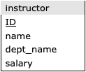

# PSO 02

### Instructor: Huangyi Ge

- PSO 01/05 materials: [github](https://github.com/gehuangyi20/cs448)

### Setup

1. [Download database](resources/sql-original.db)
2. Start SQLite `$sqlite3`
3. Open database `sqlite> .open sql-original.db`
4. Setup headers
```
sqlite> .header on
sqlite> .mode column
```

### Schema for instructor relation

Recall the schema that we used previously:



#### SQL data definition

```sql
create table instructor
    (ID             varchar(5), 
     name           varchar(20) not null, 
     dept_name      varchar(20), 
     salary         numeric(8,2) check (salary > 29000),
     primary key (ID),
     foreign key (dept_name) references department (dept_name)
        on delete set null
    );
```

#### Example data

|    ID | name       | dept_name   |   salary |
|------:|:-----------|:------------|---------:|
| 10101 | Srinivasan | Comp. Sci.  |    65000 |
| 12121 | Wu         | Finance     |    90000 |
| 15151 | Mozart     | Music       |    40000 |
| 22222 | Einstein   | Physics     |    95000 |
| 32343 | El Said    | History     |    60000 |
| 33456 | Gold       | Physics     |    87000 |
| 45565 | Katz       | Comp. Sci.  |    75000 |
| 58583 | Califieri  | History     |    62000 |
| 76543 | Singh      | Finance     |    80000 |
| 76766 | Crick      | Biology     |    72000 |
| 83821 | Brandt     | Comp. Sci.  |    92000 |
| 98345 | Kim        | Elec. Eng.  |    80000 |


## Schema Evolution

- Database design is usually not a one-time activity. 
- The needs of an organization evolve continually, and the data that it needs to store also evolve correspondingly.
- Changes in the schema can affect all aspects of the database application.

## Schema for instructor relation

Lets say that we want to add a phone number for instructors.

### Option 1

We could simply add an attribute *phone_number* to the _instructor_ relation.


#### ALTER TABLE Command

In SQLite, we add a new column `phone_number` to the `instructor` table as follows:

```sql
ALTER TABLE instructor ADD COLUMN phone_number varchar(12);
```

#### Update Records

Then, we can add phone numbers for each instructor using `UPDATE`

```sql
UPDATE instructor SET phone_number = '358-777-1265' WHERE ID = 10101;
UPDATE instructor SET phone_number = '492-554-3421' WHERE ID = 12121;
UPDATE instructor SET phone_number = '722-035-7216' WHERE ID = 15151;
UPDATE instructor SET phone_number = '275-026-7979' WHERE ID = 22222;
UPDATE instructor SET phone_number = '175-304-5605' WHERE ID = 32343;
UPDATE instructor SET phone_number = '132-360-4775' WHERE ID = 33456;
UPDATE instructor SET phone_number = '182-846-5531' WHERE ID = 45565;
UPDATE instructor SET phone_number = '722-419-0625' WHERE ID = 58583;
UPDATE instructor SET phone_number = '802-567-3477' WHERE ID = 76543;
UPDATE instructor SET phone_number = '735-031-4651' WHERE ID = 76766;
UPDATE instructor SET phone_number = '573-255-8741' WHERE ID = 83821;
```

Note: we haven't added a phone number for instructor Kim (ID = 98345).

#### Updated Table

We can take a look at the `instructor` table with `phone_number` column and values we inserted:

```sql
select * from instructor;
```

|    ID | name       | dept_name   |   salary | phone_number   |
|------:|:-----------|:------------|---------:|:---------------|
| 10101 | Srinivasan | Comp. Sci.  |    65000 | 358-777-1265   |
| 12121 | Wu         | Finance     |    90000 | 492-554-3421   |
| 15151 | Mozart     | Music       |    40000 | 722-035-7216   |
| 22222 | Einstein   | Physics     |    95000 | 275-026-7979   |
| 32343 | El Said    | History     |    60000 | 175-304-5605   |
| 33456 | Gold       | Physics     |    87000 | 132-360-4775   |
| 45565 | Katz       | Comp. Sci.  |    75000 | 182-846-5531   |
| 58583 | Califieri  | History     |    62000 | 722-419-0625   |
| 76543 | Singh      | Finance     |    80000 | 802-567-3477   |
| 76766 | Crick      | Biology     |    72000 | 735-031-4651   |
| 83821 | Brandt     | Comp. Sci.  |    92000 | 573-255-8741   |
| 98345 | Kim        | Elec. Eng.  |    80000 |                |

Remember: we didn't add a phone number for instructor Kim (ID = 98345).

## Schema for instructor relation

What if we want to have multiple phone number for instructors?

### Option 2

If we make the attribute `phone_number` part of the primary key, then we could have multiple phone numbers per instructor.


#### Example data

|    ID | name       | dept_name   |   salary | phone_number   |
|------:|:-----------|:------------|---------:|:---------------|
| 10101 | Srinivasan | Comp. Sci.  |    65000 | 999-113-1268   |
| 10101 | Srinivasan | Comp. Sci.  |    80000 | 906-214-7631   |

What's wrong with this approach?

- It creates redundancy in the database (breaking Boyce-Codd Normal Form).
- It can cause data inconsistencies (Ex. updated salary for an instructor for only 1 record).

## Schema for instructor relation

What if we want to have multiple phone number for instructors?

### Option 3

Use of phone as an entity allows extra information about phone numbers (plus multiple phone numbers).


##### SQLite ALTER TABLE

- SQLite supports a limited subset of `ALTER TABLE`. 
- The `ALTER TABLE` command in SQLite allows the user to rename a table or to add a new column to an existing table. 
- It is **not possible** to:
  - _rename_ or _remove_ a column, or 
  - _add_ or _remove_ constraints from a table.

Therefore, the following will **not work** on SQLite:

```sql
ALTER TABLE instructor DROP COLUMN phone_number;
```

To "undo" the changes from Option (a), we can do the following:

1. create new table without the `phone_number` column,
2. copy all records,
3. drop the old table,
4. rename the new table.

#### 1. Create new instructor table

```sql
CREATE TABLE instructor_new
    (ID             varchar(5), 
     name           varchar(20) NOT NULL, 
     dept_name      varchar(20), 
     salary         numeric(8,2) check (salary > 29000),
     PRIMARY KEY (ID),
     FOREIGN KEY (dept_name) REFERENCES department (dept_name)
        ON DELETE SET NULL
    );
```

#### 2. Copy all records

```sql
INSERT INTO instructor_new
SELECT instructor.ID, instructor.name, instructor.dept_name, instructor.salary
FROM instructor;
```

#### 3. Drop old table

```sql
DROP TABLE instructor;
```

#### 4. Rename new table

```sql
ALTER TABLE instructor_new RENAME TO instructor;
```

## Schema for instructor relation

What if we want to have multiple phone number for instructors?

### Option 3

Use of phone as an entity allows extra information about phone numbers (plus multiple phone numbers).


#### SQL data definitions

Create a table to store and assign the phone numbers:

```sql
CREATE TABLE phone
    (phone_number   varchar(12), 
     location       varchar(6)
             CHECK (location IN ('Office', 'Cell', 'Home', 'Other')), 
     ID             varchar(5), 
     PRIMARY KEY (phone_number),
     FOREIGN KEY (ID) REFERENCES instructor (ID)
            ON DELETE SET NULL
    );
```


#### Questions

1. Does this require that everyone has a phone number?
3. What happens if we make the instructor ID part of the primary key?

#### Answers

1. This schema does not require instructors to have a phone number.
3. Making the instructor ID part of the primary key allows for instructors to have the same phone number.

#### INSERT Commands for Table: phone

These will add the phone numbers:

```sql
INSERT INTO phone VALUES ('358-777-1265', 'Office', '10101');
INSERT INTO phone VALUES ('492-554-3421', 'Office', '12121');
INSERT INTO phone VALUES ('722-035-7216', 'Office', '15151');
INSERT INTO phone VALUES ('275-026-7979', 'Office', '22222');
INSERT INTO phone VALUES ('175-304-5605', 'Office', '32343');
INSERT INTO phone VALUES ('132-360-4775', 'Office', '33456');
INSERT INTO phone VALUES ('182-846-5531', 'Office', '45565');
INSERT INTO phone VALUES ('722-419-0625', 'Office', '58583');
INSERT INTO phone VALUES ('802-567-3477', 'Office', '76543');
INSERT INTO phone VALUES ('735-031-4651', 'Office', '76766');
INSERT INTO phone VALUES ('573-255-8741', 'Office', '83821');
INSERT INTO phone VALUES ('711-239-7079', 'Cell', '10101');
INSERT INTO phone VALUES ('357-271-7033', 'Cell', '12121');
INSERT INTO phone VALUES ('865-740-1566', 'Cell', '15151');
INSERT INTO phone VALUES ('341-066-0914', 'Cell', '22222');
INSERT INTO phone VALUES ('843-858-5992', 'Cell', '32343');
INSERT INTO phone VALUES ('386-110-2746', 'Cell', '33456');
INSERT INTO phone VALUES ('532-340-6156', 'Cell', '45565');
INSERT INTO phone VALUES ('593-208-3674', 'Cell', '58583');
INSERT INTO phone VALUES ('851-114-9021', 'Cell', '76543');
INSERT INTO phone VALUES ('759-309-1635', 'Cell', '76766');
INSERT INTO phone VALUES ('691-011-8290', 'Cell', '83821');
```

Note: we haven't added a phone numbers for instructor Kim (ID = 98345).

### Updated records

Show the instructor IDs, names, and _Office_ phone numbers

#### Query

```sql
SELECT instructor.ID, instructor.name, phone.phone_number, phone.location 
FROM instructor
LEFT JOIN phone ON instructor.ID = phone.ID
WHERE location = 'Office';
```

#### Result

|    ID | name       | phone_number   | location   |
|------:|:-----------|:---------------|:-----------|
| 10101 | Srinivasan | 358-777-1265   | Office     |
| 12121 | Wu         | 492-554-3421   | Office     |
| 15151 | Mozart     | 722-035-7216   | Office     |
| 22222 | Einstein   | 275-026-7979   | Office     |
| 32343 | El Said    | 175-304-5605   | Office     |
| 33456 | Gold       | 132-360-4775   | Office     |
| 45565 | Katz       | 182-846-5531   | Office     |
| 58583 | Califieri  | 722-419-0625   | Office     |
| 76543 | Singh      | 802-567-3477   | Office     |
| 76766 | Crick      | 735-031-4651   | Office     |
| 83821 | Brandt     | 573-255-8741   | Office     |

Note: There is no phone number for instructor Kim (ID = 98345), so their record does not show because we are filtering by phone location.

### Updated records

Show the instructor IDs, names, and phone numbers for _Office_ (if any).

#### Query

```sql
SELECT instructor.ID, instructor.name, phone.phone_number, phone.location 
FROM instructor
LEFT JOIN phone ON instructor.ID = phone.ID
WHERE location = 'Office' OR location IS NULL;
```

#### Result

|    ID | name       | phone_number   | location   |
|------:|:-----------|:---------------|:-----------|
| 10101 | Srinivasan | 358-777-1265   | Office     |
| 12121 | Wu         | 492-554-3421   | Office     |
| 15151 | Mozart     | 722-035-7216   | Office     |
| 22222 | Einstein   | 275-026-7979   | Office     |
| 32343 | El Said    | 175-304-5605   | Office     |
| 33456 | Gold       | 132-360-4775   | Office     |
| 45565 | Katz       | 182-846-5531   | Office     |
| 58583 | Califieri  | 722-419-0625   | Office     |
| 76543 | Singh      | 802-567-3477   | Office     |
| 76766 | Crick      | 735-031-4651   | Office     |
| 83821 | Brandt     | 573-255-8741   | Office     |
| 98345 | Kim        |                |            |

Note: There are no phone numbers for instructor Kim (ID = 98345) so the column appears empty.
